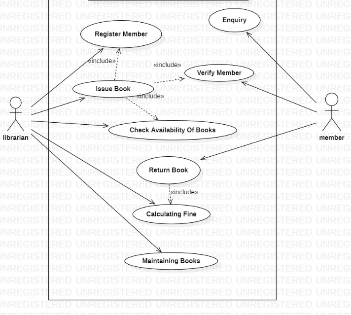
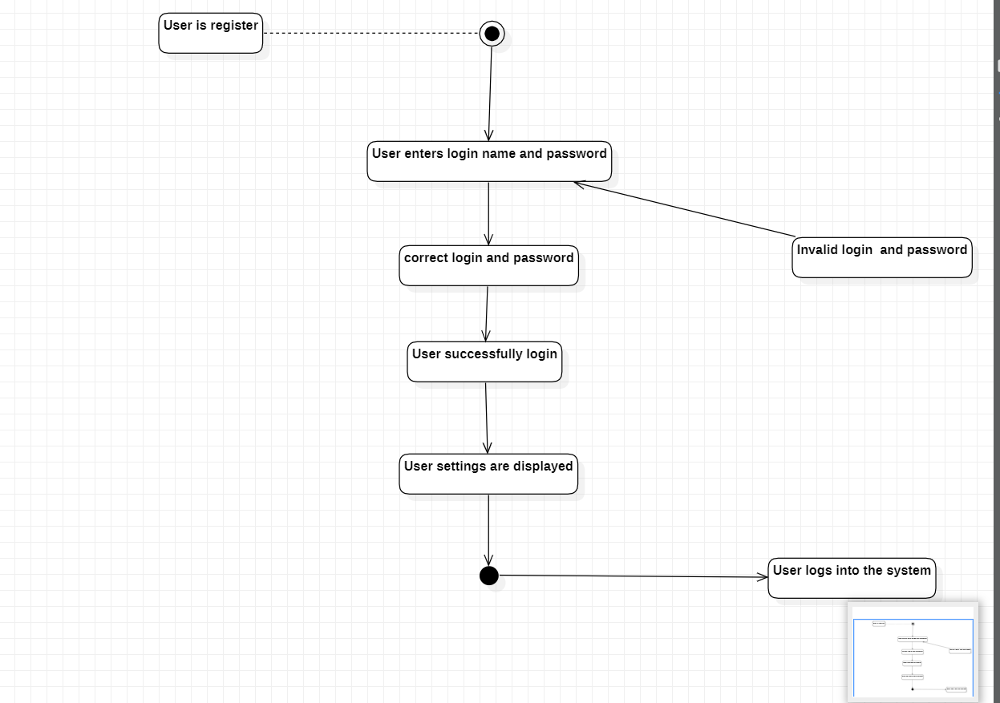

# Library-Management
### AIM:
To study the problem statement, SRS document and draw all the UML diagrams of a Library Management System.
### PROBLEM STATEMENT:
To create Library Management System software that will meet the needs of the applicant
and help them to registering and buy the book for the Library, modification in database and
cancellation for the registered project.
### OVERALL DESCRIPTION:
The Library Management System is an integrated system that has four modules as part of
it. The four modules are
#### Registration for Membership:
In this module, the user can select the books to register for the library,Modification in the book
database, cancelling the books.
#### Book details:
In this module the user can search for the books by giving bookie in the project and selecting
the semester for the book.
Maintaining Book Details:
In this module the administrator can change the data’s like the semester, address, books can be
done.
#### Cancellation for the Book:
In this module the user can cancel their name which is registered for the Book.
### SOFTWARE REQUIRMENTS:
Star UML
# UML Diagrams:
Developed By: Ganesh R
Reg No: 212222240029
## USE CASE DIAGRAM:

## CLASS DIAGRAM:

## ACTIVITY DIAGRAM:

## COMMUNICATION DIAGRAM:

## SEQUENCE DIAGRAM:

## PACKAGE DIAGRAM:

## STAECHART DIAGRAM:

### RESULT:
Thus the Library management system project was executed and the output was verified.
